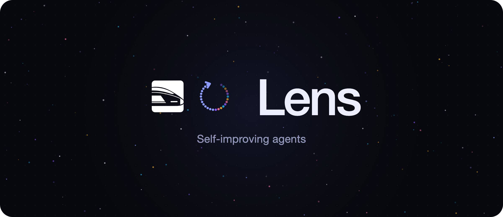
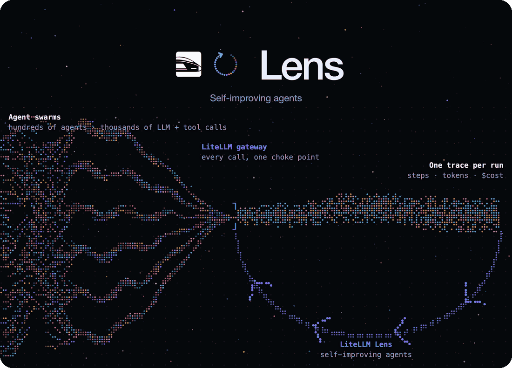
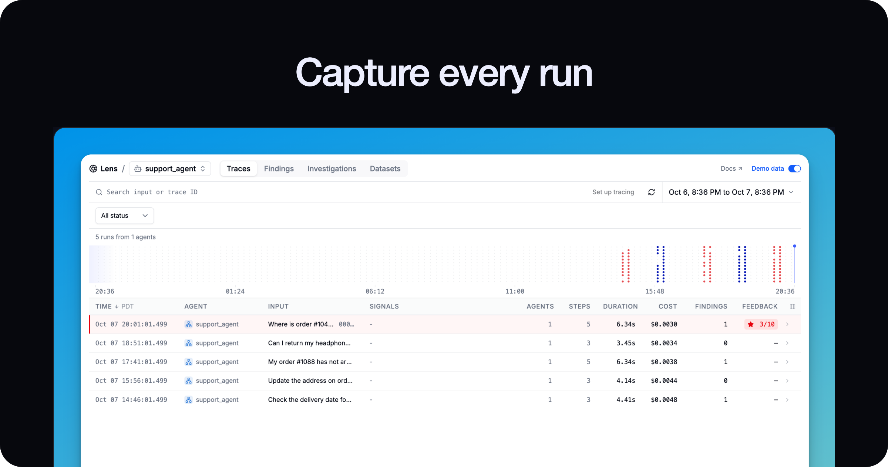
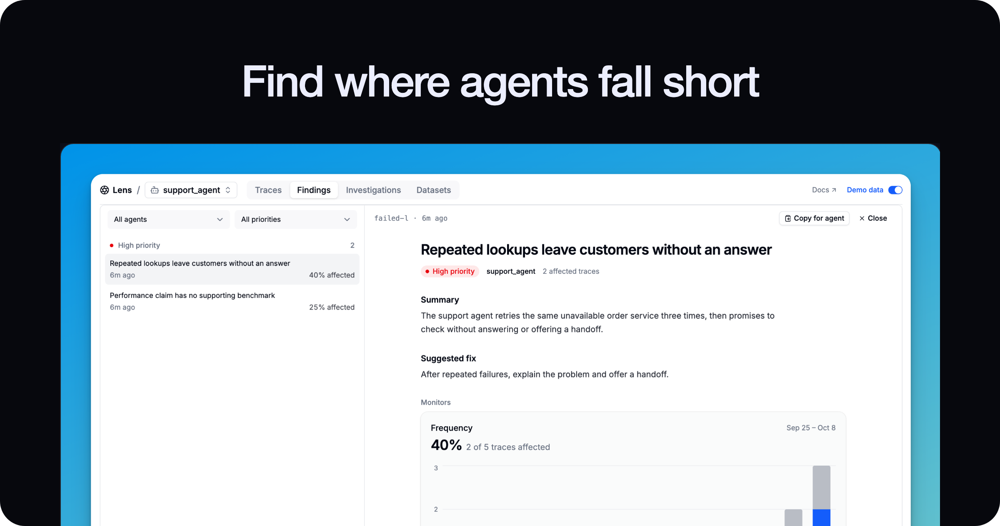
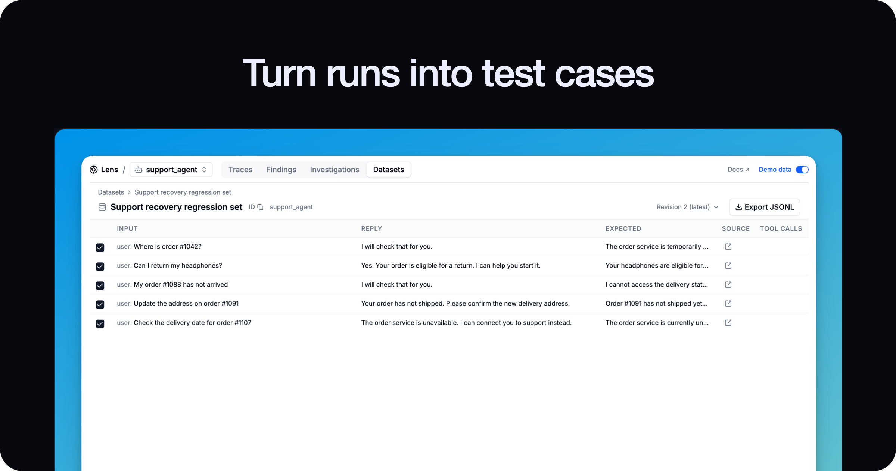
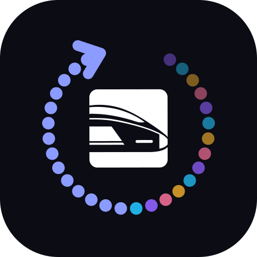

  

  

**Your agents run. Lens watches every run, finds what went wrong, and feeds it back.** 
**The next run is better.**

 

[Early access](https://forms.gle/3GC1Ner4vjthGWi18) &nbsp;&nbsp;·&nbsp;&nbsp; [Docs](https://docs.litellm.ai/docs/proxy/lens) &nbsp;&nbsp;·&nbsp;&nbsp; [Launch post](https://docs.litellm.ai/blog/litellm-lens-launch) &nbsp;&nbsp;·&nbsp;&nbsp; [4K film](assets/lens-hero-4k.mp4)

  

  

  

  

 

**Built into LiteLLM.** Your traces stay in your own ClickHouse, next to your gateway. 
Point Claude Code or Codex at them and let your agents improve your agents.

 

[Get started](https://docs.litellm.ai/docs/proxy/lens)

