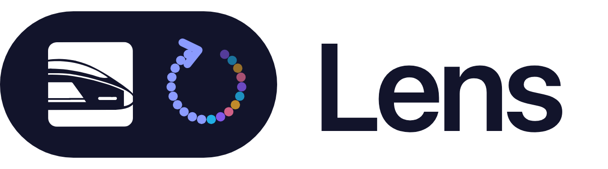

<div align="center">
  <a href="https://github.com/BerriAI/lens">
    <picture>
      <source media="(prefers-color-scheme: dark)" srcset="assets/lens-logo-dark.png">
      <source media="(prefers-color-scheme: light)" srcset="assets/lens-logo-light.png">
      
    </picture>
  </a>

<h3>Self-improving agents, on your infrastructure.</h3>

**[Start locally](deploy/lens/README.md#start-locally)** with Git and Docker, or **[Set it up for me](docs/setup-with-agent.md)** with your coding agent

For a hosted installation, [deploy Lens on Render](docs/render.md) with a private ClickHouse database and the shared GitHub App service

<details>
<summary>Copy a setup prompt</summary>

```text
Set up Lens for this project using https://github.com/BerriAI/lens/blob/main/docs/setup-with-agent.md. Inspect the existing project and deployment first. Reuse a working Lens installation if one exists; otherwise start standalone Lens with ClickHouse using the documented source quickstart. Ask only for consequential missing choices. Preserve configuration, data, secrets, and my agent's model connection. Connect this project's instrumentation and verify a real run by its trace ID, including its input, output, and tool calls. Report the Lens URL, changes made, and verification results without exposing credentials.
```

</details>

<br>


<br><br>

**Your agents run. Lens watches every run, finds what went wrong, and feeds it back.**<br>
**The next run is better.**

<br>

[Early access](https://forms.gle/3GC1Ner4vjthGWi18) &nbsp;&nbsp;·&nbsp;&nbsp; [Docs](deploy/lens/README.md) &nbsp;&nbsp;·&nbsp;&nbsp; [Contributing](CONTRIBUTING.md) &nbsp;&nbsp;·&nbsp;&nbsp; [Launch post](https://docs.litellm.ai/blog/litellm-lens-launch) &nbsp;&nbsp;·&nbsp;&nbsp; [4K film](assets/lens-hero-4k.mp4)

<br><br>


<br><br>


<br><br>


<br><br>


<br>

**Run Lens on its own or open it inside LiteLLM.** Your traces stay in your own ClickHouse.<br>
Point Claude Code or Codex at them and let your agents improve your agents.

<br>

[Get started](deploy/lens/README.md)

</div>
