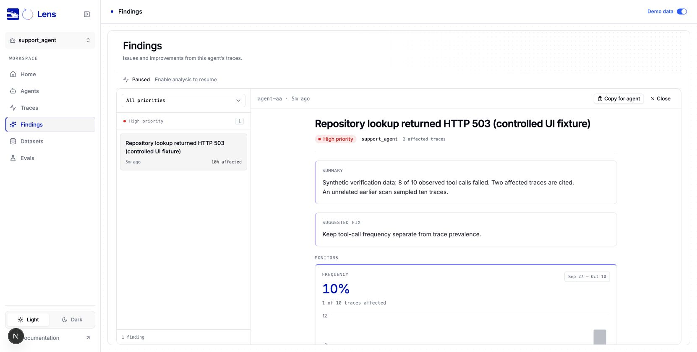
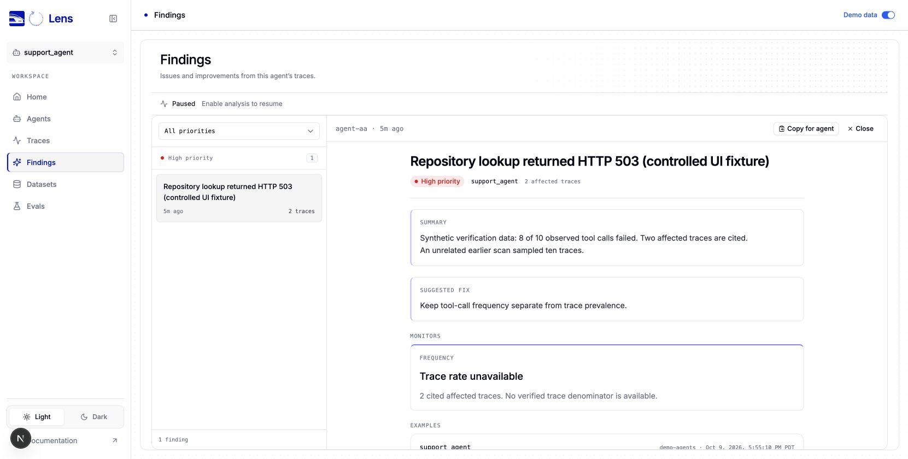

# Imported finding frequency verification

These are real browser screenshots of Lens rendered with synthetic local data. They contain no production traces or customer information. They are UI correctness evidence, not a model-quality or latency benchmark.

The fixture contains an imported finding with two cited affected traces, a textual measurement of eight failed calls out of ten tool calls, and an unrelated earlier job sampling ten traces. Only one cited trace overlaps that job. Previously the list and monitor incorrectly displayed 10%, or one of ten traces. The corrected view retains the two citations and the tool-call measurement, and states that trace prevalence is unavailable.

| Surface | Before | After |
| --- | --- | --- |
| Findings list | 10% affected | 2 traces |
| Frequency monitor | 1 of 10 traces affected | Trace rate unavailable |
| Measured tool-call evidence | 8 of 10 tool calls | 8 of 10 tool calls |





To reproduce the data conditions, use the fixture in `src/ui/lib/src/components/lens/investigations/FindingsView.integration.test.tsx`, test “keeps imported tool-call evidence without inferring trace prevalence from an unrelated job”. The test exercises the real findings list, detail panel and frequency component with only the HTTP boundary stubbed. The grouped-source and merged-finding tests cover identity preservation.

For browser verification, temporarily replace the return value in `src/ui/lib/src/components/lens/data/demo/fixtures.ts` with the following local fixture. Restore it after the capture; this fixture is not part of the shipped demo.

```ts
const sample = Array.from({ length: 10 }, (_, index) => ({
  ...lenses[0].jobs[0].sample!.executions[0],
  id: executionId(`fixture-${index}`),
}));
const proof: Finding = {
  ...lenses[0].findings[0],
  id: `agent-${"a".repeat(64)}`,
  title: "Repository lookup returned HTTP 503 (controlled UI fixture)",
  description: "Synthetic verification data: 8 of 10 observed tool calls failed. Two affected traces are cited. An unrelated earlier scan sampled ten traces.",
  occurrences: [sample[0].id, executionId("fixture-outside")],
  evidence: [], investigation_runs: [], brief: null,
  suggestion: "Keep tool-call frequency separate from trace prevalence.",
};
return { runs, lenses: [{
  ...lenses[0], findings: [proof],
  jobs: [{ ...lenses[0].jobs[0], sample: { eligible: 10, selected: 10, executions: sample } }],
}] };
```

1. Run `npm run dev:ui` and open `http://127.0.0.1:3100/ui/?demo=true&tab=findings`.
2. Select the controlled fixture finding. Compare its list row and Frequency monitor against the cited counts and summary.
3. The before capture uses the components from `52f4153`. The after capture uses `23ccdad`. Both use the same synthetic fixture.
