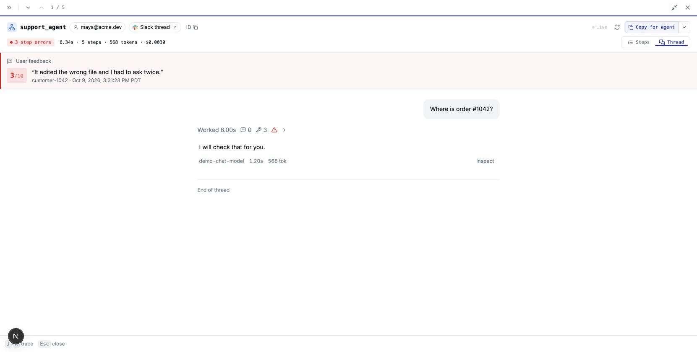
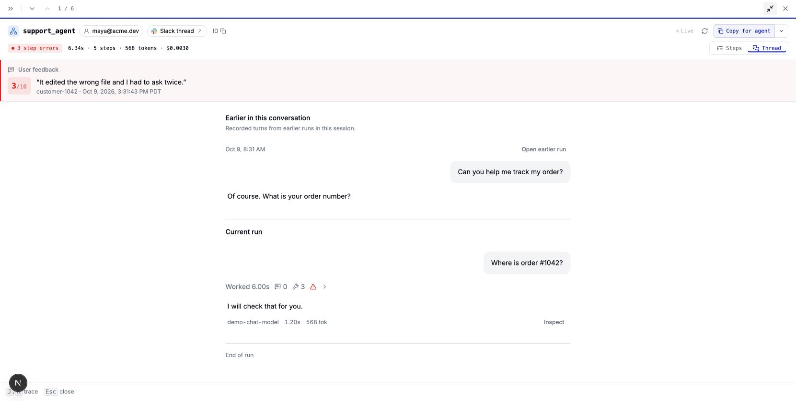

# Earlier conversation context

The selected run previously started at its current request even when earlier turns were already recorded under the same session. The Thread view now shows those earlier requests and replies first, with a separate current-run section and links to the original runs

The screenshots use built-in demo data. They contain no production conversation data

## Reproduce

1. Start the UI with `npm run dev:ui` and open `http://localhost:3100/ui/?tab=traces&demo=true`
2. Select `support_agent` and open the run whose input is `Where is order #1042?`
3. Click **View earlier turns**, then **Enter full screen**
4. Confirm that `Can you help me track my order?` and the earlier assistant reply appear above **Current run**
5. Open the earlier run using its link and confirm that its trace is shown separately

## Before

## After

Earlier context includes stored root turns from the same session and trace owner that the caller can read. It excludes the selected run and later turns, and does not include a previous run's output if that run finished after the selected run started. It does not fetch Slack messages or reconstruct content omitted before ingestion
