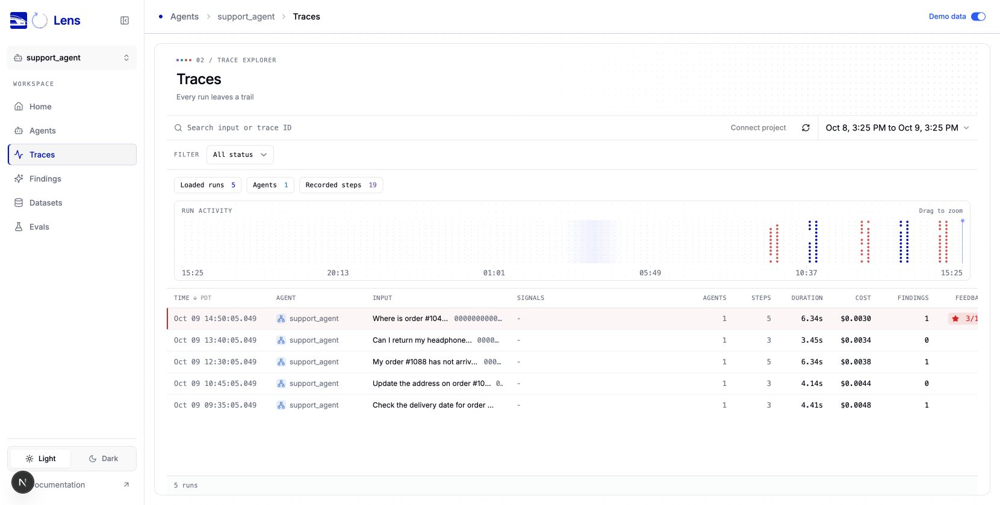
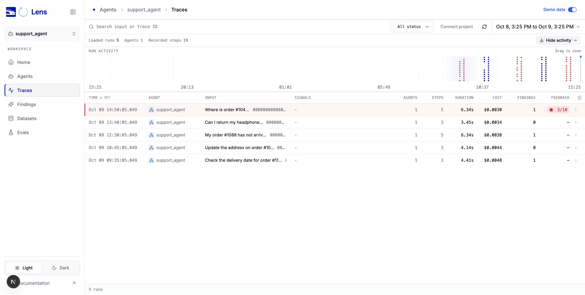
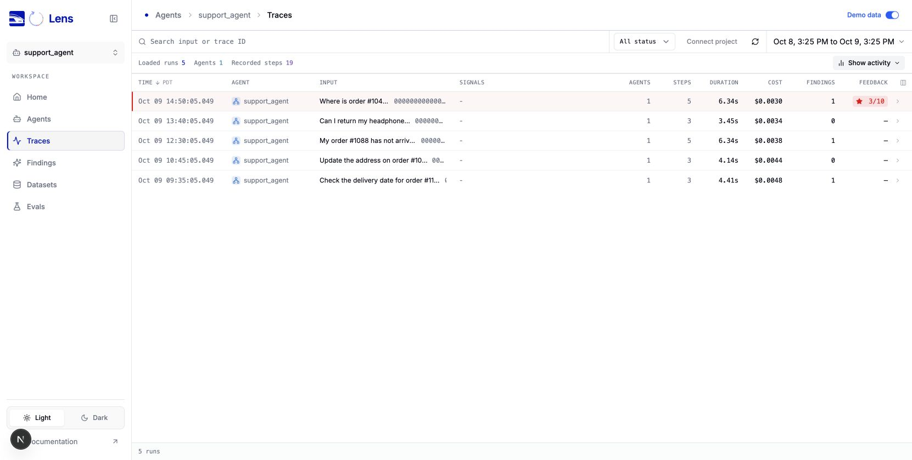
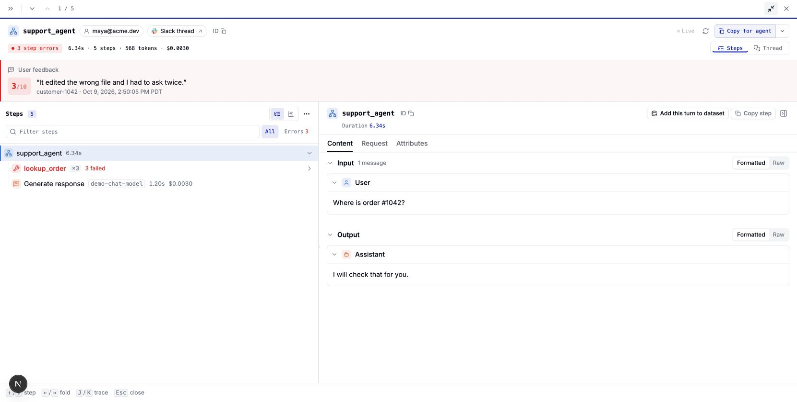
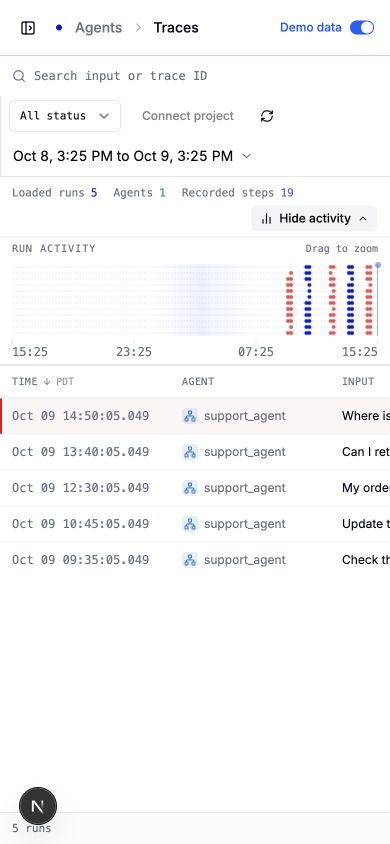

# Trace workspace layout

Browser screenshots use the built-in demo data at `/ui/?tab=traces&demo=true`

At 1661 × 840, the table header moves from approximately 480px to 262px from the top of the viewport. Hiding activity moves it to 135px. The list fills the content area beside the navigation, including the width previously reserved for the outer card margins and padding

## Reproduce

1. Run `npm ci --ignore-scripts`, then `npm run dev:ui`
2. Open `http://127.0.0.1:3100/ui/?tab=traces&demo=true`
3. Compare the compact toolbar and table with the screenshots below
4. Click **Hide activity** and **Show activity**. Drag across the activity chart to zoom, hide it, then use **Clear time zoom** to restore the rows
5. Open a trace and click **Enter full screen**, then close it. Collapse the navigation to give the list additional width
6. At a 390px viewport, verify the toolbar wraps and the table scrolls horizontally without widening the page

## Before

## After

