# Lens UI consistency

Each image pairs the same view before (left) and after (right), captured from the running standalone app at 1440 × 1000. Before is main at e5a8f906; after is c3dd4f68. Network responses use deterministic fixtures from the Lens demo and eval test data. These images validate presentation, not a live backend connection

The complete local review also includes light, dark, and 390px mobile screenshots for all 23 views. The production build, UI library and app typechecks, and 252 targeted tests passed. Browser checks covered search, trace drawers, eval navigation and refresh, new-eval cancellation, dataset selection, copying setup instructions, theme changes, and mobile navigation

## Reproduce the views

Start the UI with `npm ci` and `npm run dev:ui`. Use the app's printed address with these paths. A connected Lens service needs corresponding agents, findings, datasets, and eval runs to reproduce populated views; the screenshots use fixture responses

1. Open `/ui/?tab=home` for Home; choose **Deployment setup** to inspect setup and scroll down to its steps
2. Open `/ui/?tab=agents`, enter an agent name in **Search agents**, and select an agent to open its traces
3. Open `/ui/?tab=traces`, choose an agent, and select a trace row to open the inspector
4. Open `/ui/?tab=findings`, choose an agent with findings, and select a finding to inspect its details
5. Open `/ui/?tab=datasets`, select a dataset, and select a case to open the case inspector
6. Open `/ui/?tab=evals`, choose **New eval**, or select an existing eval, run, and case in order
7. Open `/ui/?tab=settings` and scroll to the automatic analysis section
8. Empty Agents, Datasets, and Evals require empty collections. Sign-in requires an unauthenticated session; connection error requires an unreachable Lens API

## Before and after

### Home

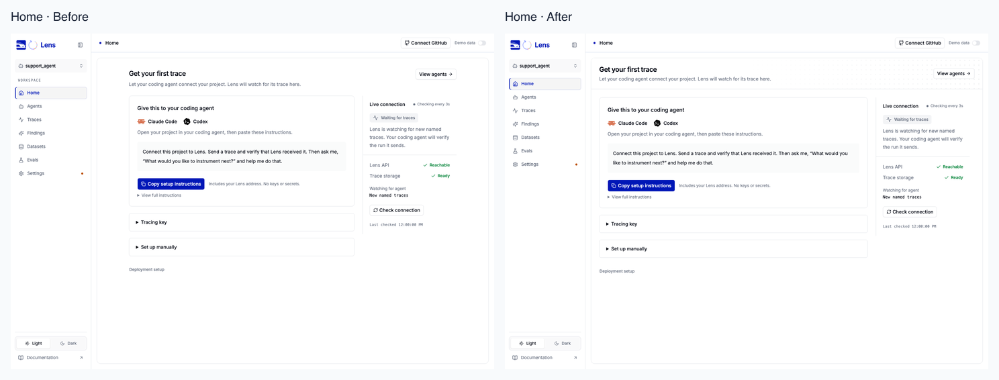

### Agents

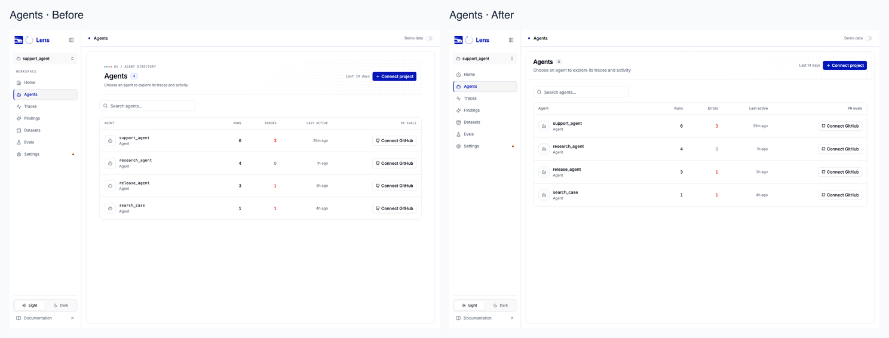

### Traces

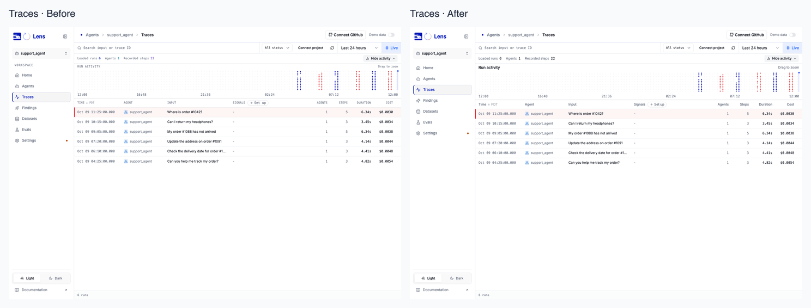

### Findings

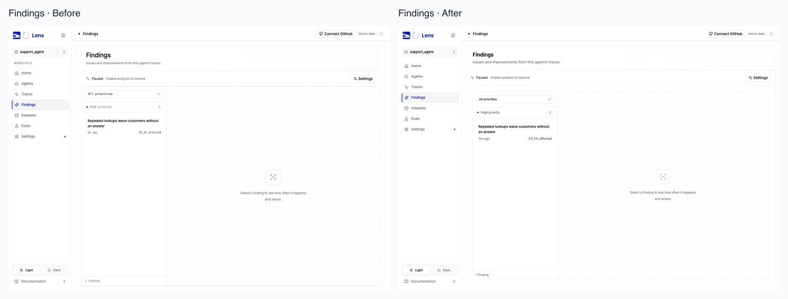

### Datasets

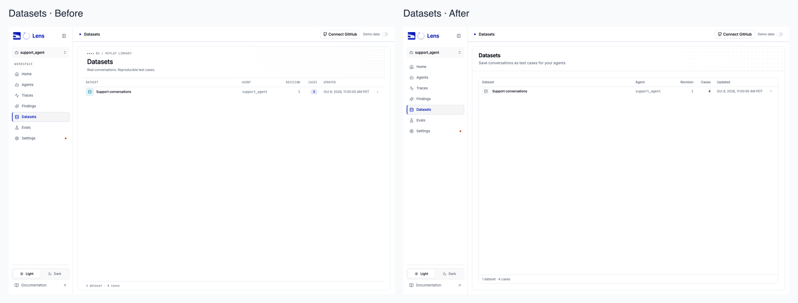

### Evals

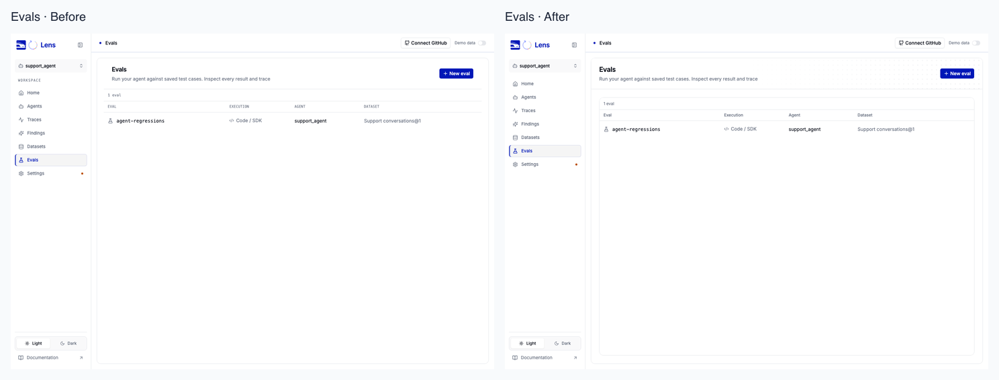

### Settings

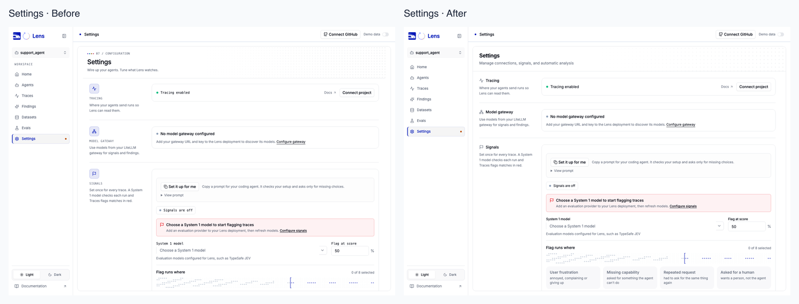

### Trace detail

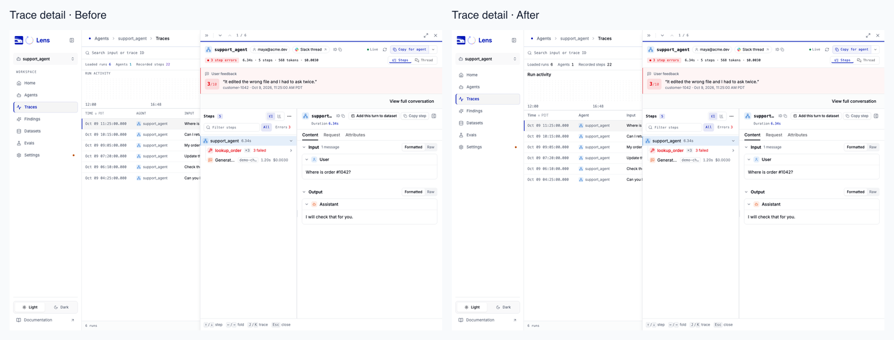

### Finding detail

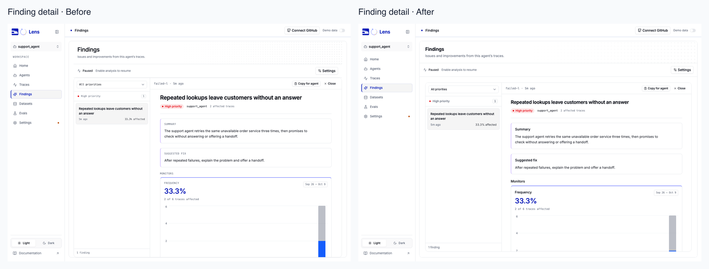

### Dataset detail

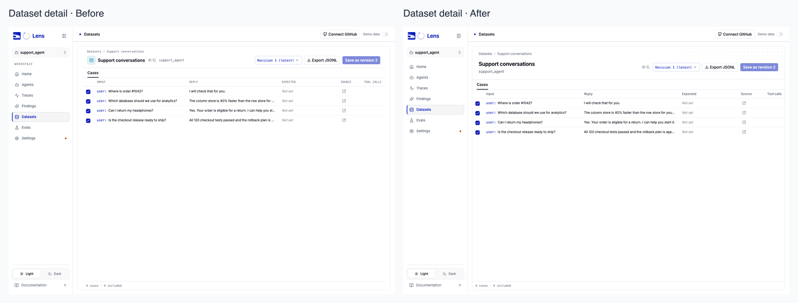

### Dataset case

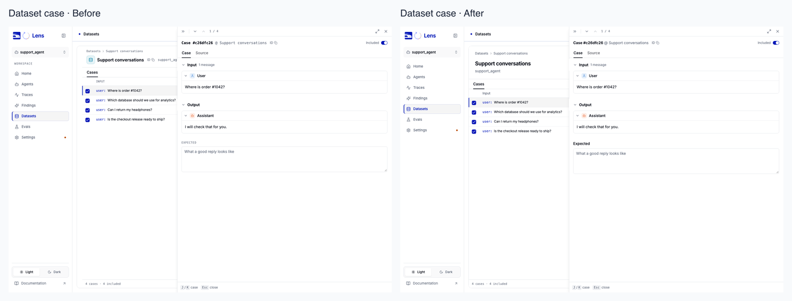

### New eval

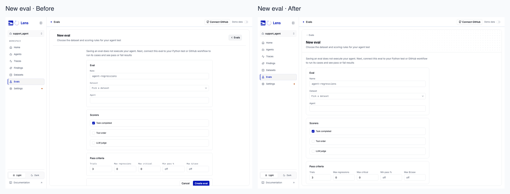

### Eval detail

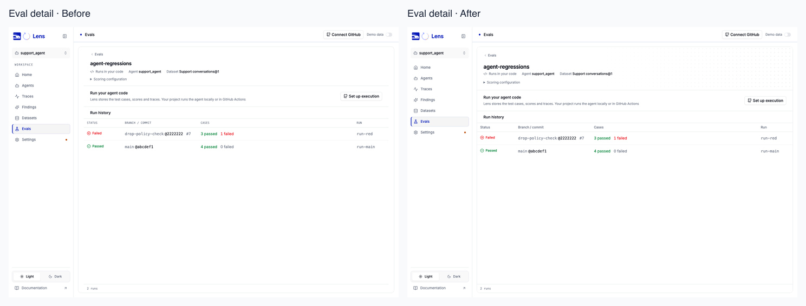

### Eval run

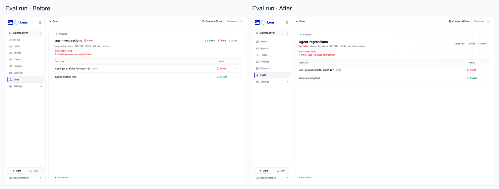

### Eval case

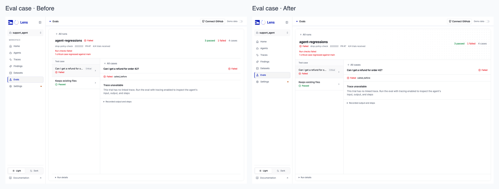

### Setup

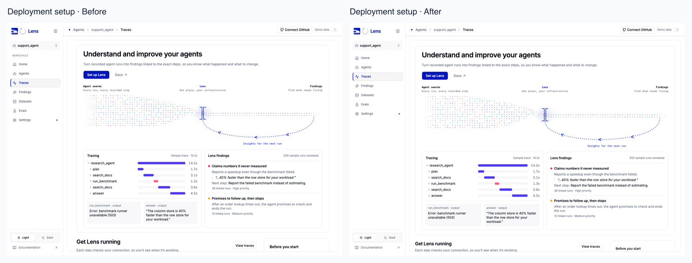

### Setup steps

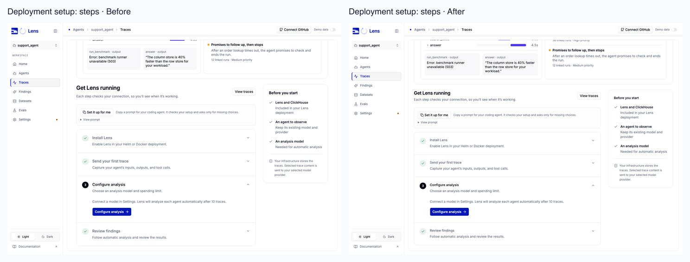

### Settings analysis

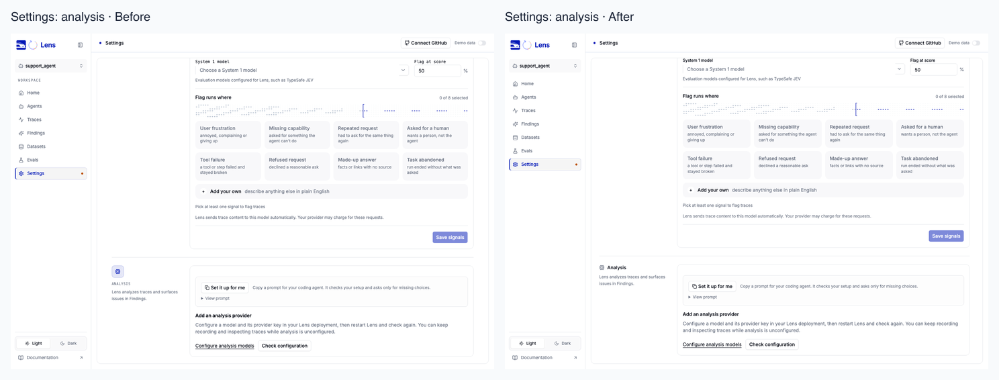

### Empty agents

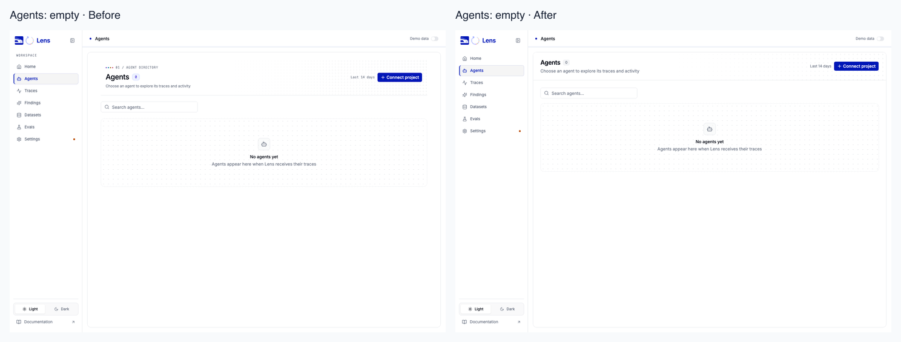

### Empty datasets

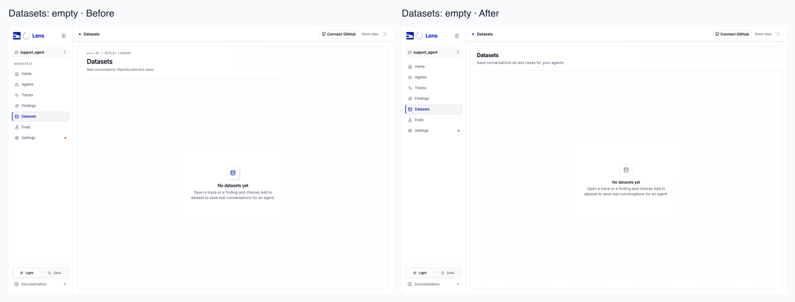

### Empty evals

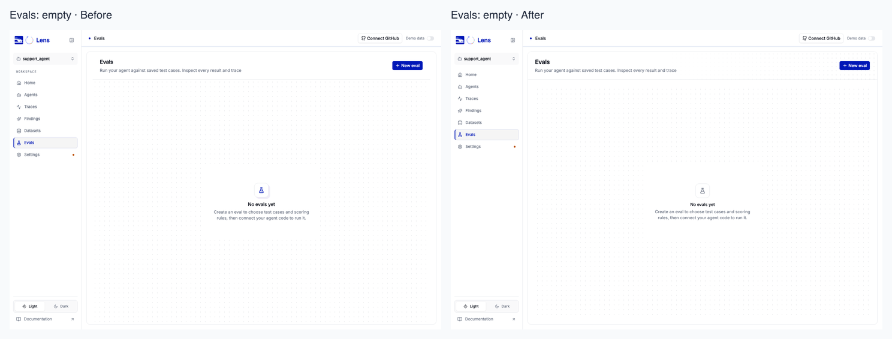

### Sign in

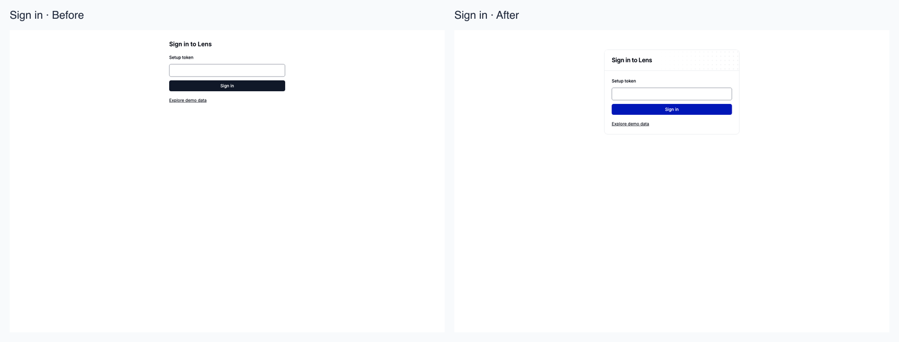

### Connection error

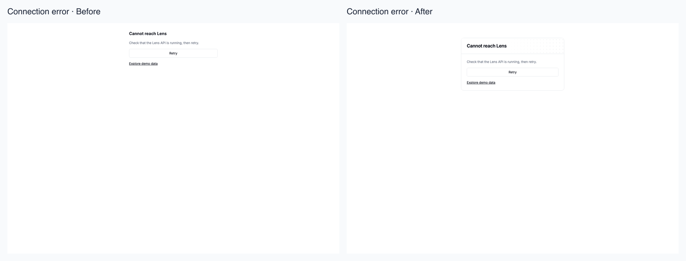
