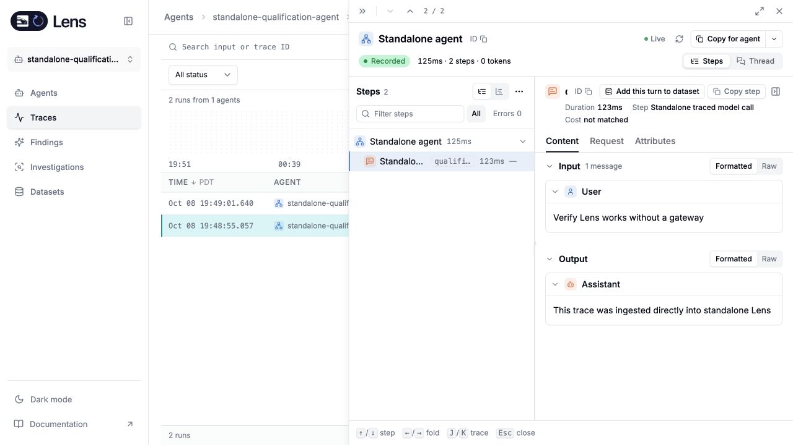
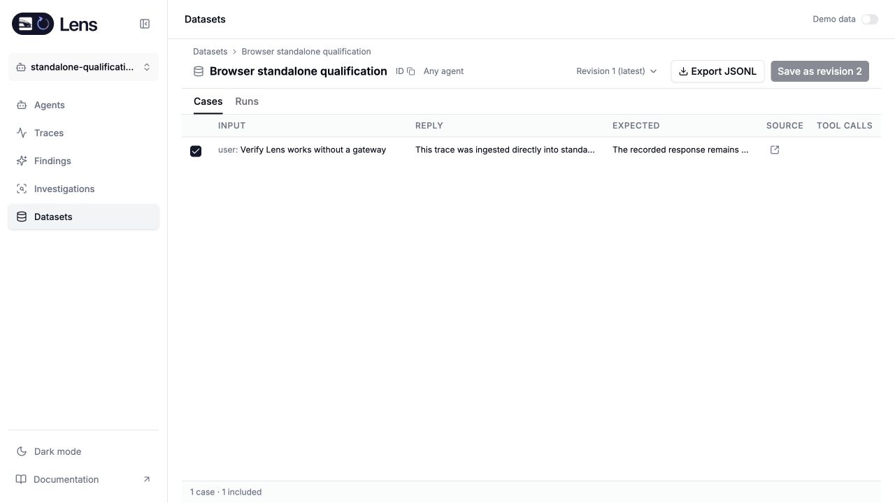

# Rust standalone bootstrap qualification

This increment starts the Rust Lens service without a gateway and serves the shared UI. It owns browser sessions, ingestion credentials, trace APIs and datasets in ClickHouse. It does not complete milestone 1: local investigation execution, direct-provider setup, feedback, signals and the final deployment workflow still require qualification

The frozen candidate was built from the bootstrap changes on `d49a2ef8`. Publication carries its source diff onto the newer plan at `a061db91`; later investigation and inference work is excluded. The isolated binary used port 4322 and a dedicated database on the supported ClickHouse instance at port 18124. Gateway URL, service-token, worker-token and delegation settings were absent

## Verification

The frozen workspace passed 2,500 regular tests, workspace Clippy with warnings denied, formatting and a locked binary build. Four normally ignored live ClickHouse cases were qualified separately. Linux sandbox tests require the Linux image and are not established by this macOS run

The actual candidate binary passed normal token login, service readiness, cookie authentication, ingestion-key creation, OTLP ingestion, scoped trace list/detail/span reads, agent listing, SQL and query-help responses, and dataset creation/build/revision saving. After stopping and restarting that binary, the saved session, ingestion key, trace and dataset remained usable. Revoking the key rejected new ingestion immediately; logout invalidated the session

Anonymous trace reads returned 401, cookie-authenticated writes without an Origin returned 403, and standalone internal service routes returned 404. Automated coverage additionally checks credential refresh ordering, fail-closed stale snapshots, public response envelopes, roles and tenant boundaries. The ingestion record contract preserves the original required-but-nullable expiry field

The browser walkthrough used the shared UI, normal login and a synthetic trace sent through the real OTLP endpoint. It opened the persisted trace after restart, added its turn to a dataset and saved an expected response. These are real service/storage checks with fixture content, not a provider-backed investigation

## Remaining boundary

The UI can still report unavailable investigation and feedback routes in this increment. No complete self-hosted release, direct-provider investigation, production recovery drill or embedded external-service cutover is claimed here. Those remain requirements in [the completion plan](completion-plan.md)
