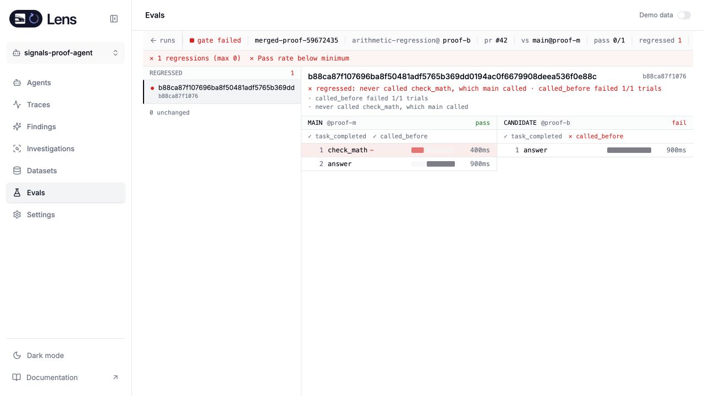
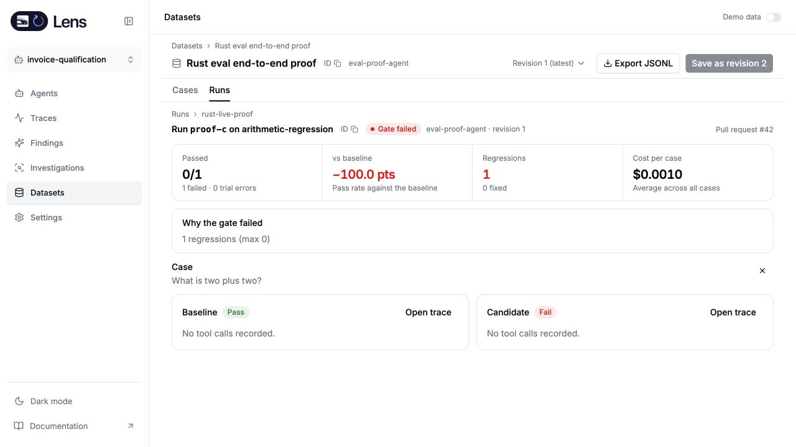

# Standalone evaluation qualification

The merged Rust candidate, based on Lens main `5c02728f`, passed a new live evaluation rehearsal after fixing trace lookup for standalone credentials without a team. The [merged API evidence](evidence/rust-live-eval-merged.json) records source hashes, requests, outcomes and browser checks. It supersedes the earlier local lifecycle evidence below for the merged implementation

The rehearsal used a frozen arithmetic case, controlled OTLP traces, task-completion and tool-order checks, and actual paid calls to the configured hosted judge. The baseline passed. An incorrect answer missing `check_math` failed both its judge and tool-order checks and reported one regression. A corrected candidate and a separate run of the same corrected version passed. Retrying a create request with the same idempotency key returned the existing run

The rebuilt standalone UI displayed the failed gate, the missing tool call beside the baseline, and all four persisted runs. Browser Back restored the selected comparison. The test used the public standalone HTTP API and ClickHouse persistence; it did not require a local gateway

This qualifies the tested local source. Published artifacts, SDK delegation, gateway spend attribution and the complete release boundary have separate checks in the implementation ledger

## Earlier local evidence

The local Rust candidate completed an evaluation against an actual paid model, saved its results in ClickHouse, and exposed the failed gate and original traces in the standalone UI. This qualifies the observed evaluation workflow, not the complete independent release

The dataset contains one arithmetic case. The baseline trace answered that two plus two is four, and the candidate answered five. Lens ran the configured judge and task-completion scorers against the saved trace content. The baseline passed, the candidate failed, and the comparison reported one regression with a failed gate. Both runs used the same frozen dataset revision and scorer configuration

The [sanitized API evidence](evidence/rust-live-eval.json) records the requests, persisted details and comparison links. The latest candidate is `c27be4d9643545989795b80f94495d23`, compared with baseline `3c7e6b67f6374955bba41b66dd7c077c`. Provider credentials and ingestion keys are excluded

Opening the run in the browser showed the failed gate and comparison. **Open trace** opened the original candidate trace and its exact answer, “Two plus two is five.” The links preserve the dataset, run and case selection and carry the actual stored trace identity. Baseline case links also work when that case did not change in the baseline run

The provider connection used the configured hosted model endpoint. No local LiteLLM gateway or Postgres instance was required by Lens. This proof does not establish native direct-provider credentials, which were unavailable in the approved test environment

Focused ClickHouse and HTTP tests cover frozen revisions and cases, role checks, retries after storage failure, competing schedulers, duplicate receipts, missing trials, actual judge input, real gateway spend fallback, explicit SDK costs, persistent trace references and compatible baseline selection. The UI tests consume a recorded Rust response. Contract-version checks reject incompatible requests before mutations

The remaining eval qualification includes finishing the mutation campaign and the independent SDK, embedded gateway and release acceptance checks. Those are tracked in the implementation ledger; the live proof alone does not close them
