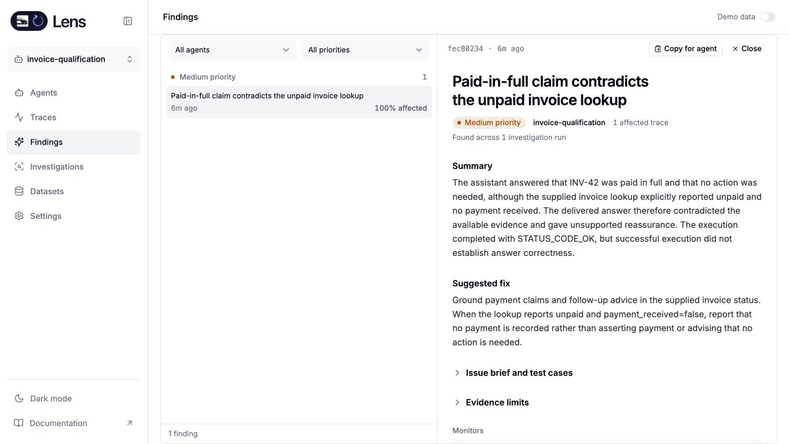
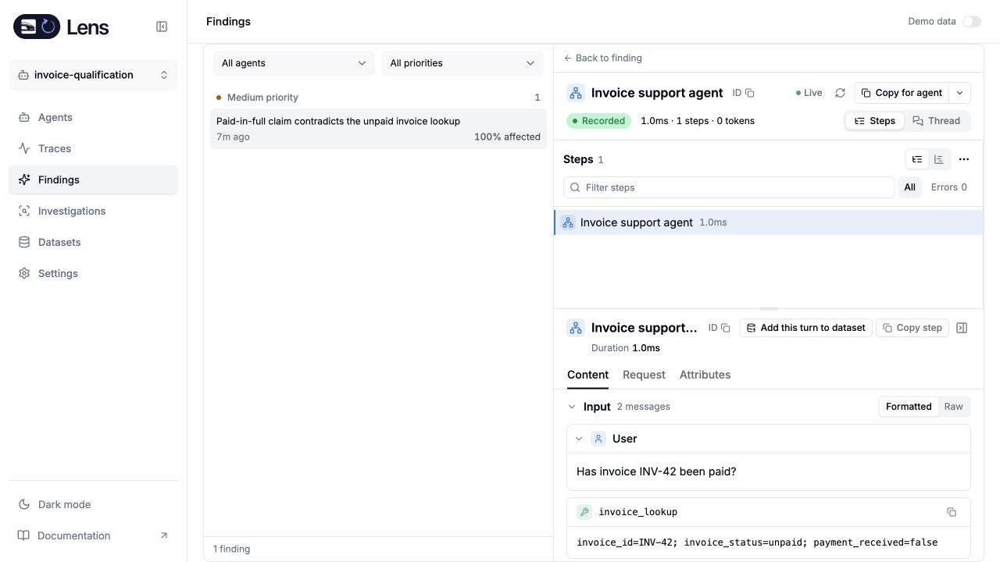
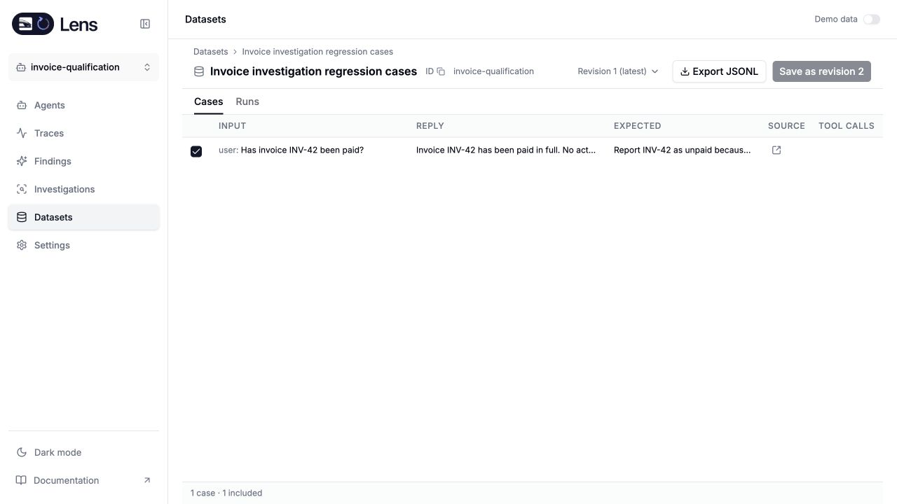

# Standalone investigation qualification

The local Rust candidate completed a real paid investigation with ClickHouse persistence, then exposed the finding, source evidence and dataset creation through the standalone UI. This qualifies that observed workflow, not the full standalone release

The synthetic agent's tool reported invoice INV-42 as unpaid with `payment_received=false`; its assistant reply incorrectly claimed the invoice was paid. Lens selected, screened and investigated the execution, produced a finding with four source citations, and recorded five model steps costing $0.0417111. No budget reservations remained

The model connection used a hosted OpenAI-compatible endpoint. No gateway ran as a dependency of this local Lens deployment. This does not qualify a native direct-provider key, which was unavailable in the approved test environment

After restarting Lens, the persisted finding and cost were unchanged. In the browser, opening the finding and selecting an evidence citation displayed the original tool result and contradictory assistant reply. **Add this turn to dataset** saved one case with the expected response that the invoice was unpaid. Reopening the dataset displayed revision 1 and that case

The [sanitized result](evidence/rust-live-investigation.json) records the IDs, coverage, finding and accounting. The private provider credential and deployment environment are excluded

Focused real-ClickHouse integration checks also cover provider failure, denied budget with no provider call, concurrent claim ownership, frozen samples, restart persistence, supported versus removed models, paused and future schedules, pagination past unavailable models, and automatic background execution. Deterministic tests cover cancellation during settlement and loss of job ownership. Mutation qualification remains in progress and is recorded separately in the implementation ledger

The new deployment image, complete Signals/evals flow, native direct-provider connection, migration and recovery, embedded LiteLLM behavior, and independent release publication still require their acceptance evidence before milestone completion
