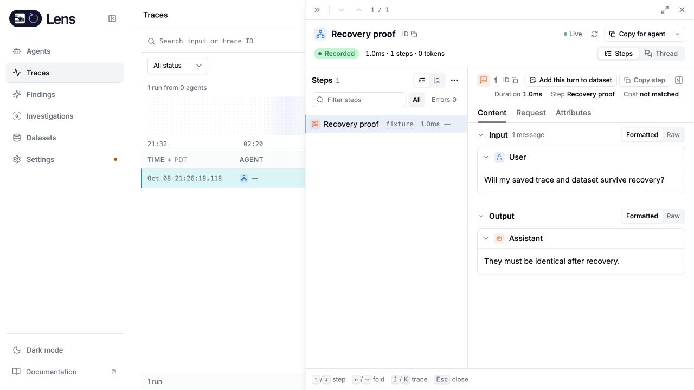

# Standalone container and recovery qualification

The initial native ARM64 container candidate serves the static UI and Rust API without a gateway or PostgreSQL. Its generated environment file has mode 0600 and separate administrator and storage credentials. Repeating installation preserves that file. The process runs as UID 65532 with a read-only root filesystem, dropped capabilities, no-new-privileges and bounded temporary storage.

`deploy/lens/smoke.sh` passed API authorization, actual OTLP ingestion, UI delivery, and retained trace data after restarting both Lens and ClickHouse. The native calculation-sandbox target passed all ten cases, including filesystem/network confinement, resource limits, cancellation and cleanup. [Sandbox output](evidence/rust-native-sandbox.log).

`deploy/lens/recovery-smoke.mjs` created a dataset case from an ingested trace, saved revision 1, opened a session, and performed a cold backup. It restored into a different Compose project from the archived image, environment and ClickHouse volume. The trace, dataset object, exported case, session and ingestion key were retained. Existing projects, environment files, symlinks and corrupted backups were rejected. [Recovery result](evidence/rust-container-recovery.json).

A separate browser check signed into the restored deployment using its retained administrator credential, opened the trace and confirmed the original output. The dataset list retained revision 1 and one case.

The first container attempt exposed a startup race: a local ClickHouse client can reach the temporary bootstrap listener before another container can connect. The readiness check now addresses ClickHouse through its network hostname. Another test-harness defect used Docker copy against a read-only container; the test now writes its private temporary header through the container's writable temporary mount. Neither fix removes container confinement.

The initial image is `sha256:fa1b95bc4ec5b63015b294b18e2f6c833998ddf5ecbccf423910cb0da7fef609`, built from `/tmp/lens-container-build.0vMC6F`. This snapshot predates the final Signals/evals UI, connected-mode/privacy guard, canonical dependency update and state compaction. These results establish the deployment and recovery mechanisms; the final source image must repeat qualification before it is called ready.

This rehearsal used a single-node bundled ClickHouse+Keeper stack and synthetic data. It does not qualify replicated storage recovery or production cutover.
