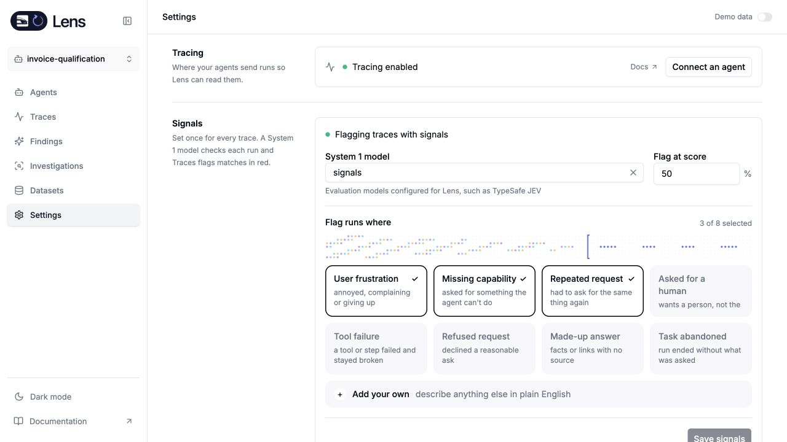
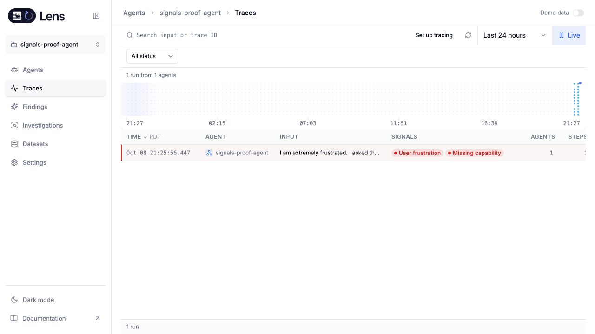
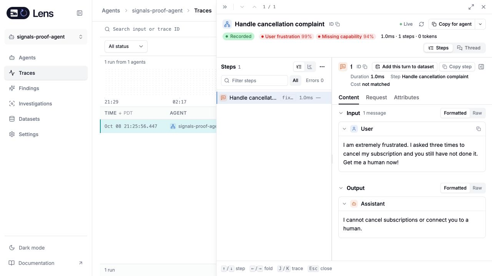

# Standalone Signals qualification

The local Rust service completed the actual Signals workflow using a Typesafe model through an authorized hosted gateway passthrough. No local LiteLLM gateway was required. This does not establish a direct native provider-key deployment, which was unavailable in the test environment.

In the standalone UI, selecting the configured `signals` model and saving enabled classification. Refreshing the page retained the setting. A synthetic trace contained a frustrated subscription-cancellation request and an assistant response saying it could neither cancel nor reach a human. The background worker classified it and persisted **User frustration** at 0.99 and **Missing capability** at 0.94.

The trace list displayed both flags. Opening the run displayed the original input and response. [Sanitized result](evidence/rust-live-signals.json).

The later UI wording explicitly explains automatic provider data transfer and possible cost before saving. That wording and the final source image remain part of integrated qualification.
