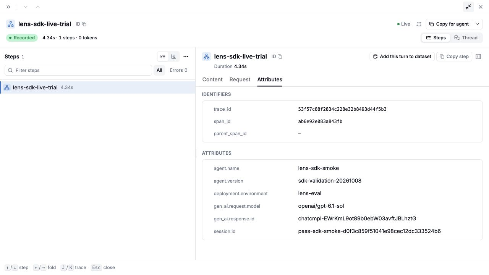

# Verification, 2026-10-08

The SDK was exercised against `https://gateway-dev.litellm-sandbox.ai` using a temporary Lens-scoped key. `Client.resolve("model-release-bench@1")` and `Client.cases(...)` downloaded revision 1 of dataset `9154d122-1f48-48d5-ac9c-5d622031b6e8`, containing one real production-derived case. Raw case content and credentials are excluded from this repository

The deployed gateway does not yet advertise `/lens/evals/` routes. The following evidence therefore separates live transport from local synthetic scoring

The actual `lens eval` CLI ran `examples/live_gateway.py` against a local contract server seeded with that downloaded revision. All three tasks called the deployed gateway using `openai/gpt-6.1-sol` and exported completed OTLP traces to its existing Lens ingest endpoint. Every inference and ingest request returned HTTP 200. The gateway reported total cost $0.004346. The CLI exited 0 with three uploaded trials, one completed case, and no trial errors

The same evaluation version was run again using the built wheel installed into a fresh virtual environment. It created a distinct run, used the first run as baseline, completed all three trials and reported zero regressions. This repeat can use gateway response caching. Its gate and baseline result came from the synthetic contract server, not the pending production scorer

[Open the persisted trace](https://gateway-dev.litellm-sandbox.ai/ui/lens?tab=traces&agent=lens-sdk-smoke&trace=53f57c88f2834c228e32b8493d44f5b3&span_tab=attributes&fullscreen=true). The signed-in dashboard showed all three traces and verified the root attributes `session.id`, `agent.name`, `agent.version`, and `deployment.environment=lens-eval`

`live.json` records sanitized request results and CLI run payloads. Local run URLs are ephemeral development-server URLs

The local verification suite passes 50 behavioral tests with 92% statement coverage, including subprocess tests over real local HTTP. It checks the 36-by-3 golden lifecycle, majority ties, missing trials, baseline compatibility, regression/fix cycles, distinct executions at one SHA, bounded concurrency, task timeout/error conversion, retry/idempotency recovery, immutable subset/gate operations, dataset identity checks, JSON isolation, exit codes, partial multi-eval failure, protected initialization, GitHub comment ownership/upserts and authoritative check verdicts

The targeted mutation run killed 20 of 20 deliberate behavioral faults. `mutations.json` names each one; this is a focused regression check, not a claim of exhaustive mutation coverage. Run it with `uv run --project packages/sdk python packages/sdk/scripts/mutation_check.py`

Ruff checks, formatting, strict mypy, and provisional schema drift checks pass. The wheel and source distribution build. A clean environment imports both `lens` from `lens-evals==0.1.0a1` and `litellm_lens` from `litellm-lens==0.1.0`; the latter was installed without its server dependencies for this namespace-conflict check

The GitHub workflow runs SDK tests on Python 3.11 and 3.13 and exercises the actual composite Action against the development server, including a real GitHub check and Action outputs. [Hosted run 37857752356](https://github.com/BerriAI/lens/actions/runs/37857752356) passed both Python jobs, the composite Action job, output validation, and the real `Lens / demo` GitHub check

Still pending: the Rust-exported eval schema and shared Rust fixture validation, production eval lifecycle/scoring/baseline integration, and the agent's service-token/sandbox adapter plus real regression PR ship test. The live smoke task generates a support response and traces it; it does not launch the deployed agent or establish the quality of its responses

To reproduce the real-data smoke test, download an accessible `EvalCases` response through `Client.resolve` and `Client.cases`, save it outside the repository, and start `lens dev-server --dataset-file /absolute/path/cases.json`. In another terminal configure `[tool.lens].project="lens-sdk-smoke"`, set `LENS_API_KEY=lens-dev`, `LENS_BASE_URL=http://127.0.0.1:8765`, and the live gateway/trace environment variables described in the README. Run `lens eval packages/sdk/examples/live_gateway.py --json` from the configured project. This deliberately sends the selected dataset input to that gateway and trace store

The temporary validation key was blocked after testing (HTTP 200). A subsequent dataset request using that key returned HTTP 401. Temporary credential snapshots and the downloaded case payload were removed locally

The SDK guide was checked in a fresh project with the package installed from GitHub. Its local quickstart completed 36 cases and 108 trials, then the failing variant exited 1 with 36 regressions against the main baseline. The synchronous and asynchronous report examples, case and finding subsets, stricter gate, multi-scorer configuration, and CLI selection/discovery also passed against the local server. All seven Python snippets parse, and the complete live example matches `examples/live_gateway.py`

After integrating current main, the 50-test suite, 92% coverage, Ruff, strict mypy, provisional schema check, and wheel/source builds passed again. No production eval scoring was added or verified by this integration
